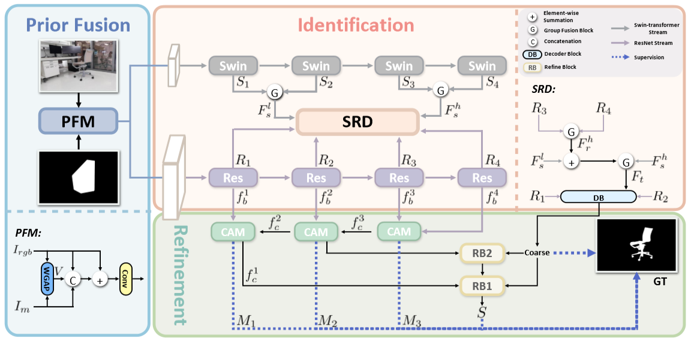

# BSRNet
Official code repository for paper **Prior Mask-Guided Highly Accurate Dichotomous Image Segmentation** ([PRICAI2024](https://link.springer.com/chapter/10.1007/978-981-96-0125-7_10)).

## Overall Architecture
<p align="center">
     <br />
 <em> 
     Overall architecture of the proposed BSRNet.
    </em>
</p>

## Inference
Download the pretrained model at [Google Driver](https://pan.baidu.com/s/1F629WgkeGQuOtDVOfBjHKA).


## Results
<p align="center">
     <br />
 <em> 
     Quantitative Results. The best results are highlighted in bold, and the second-best is marked in underline. ↑/↓ means that a larger/smaller value is better.
    </em>
</p>

 ### Download
The prediction maps can be download from [Google Driver](https://drive.google.com/drive/folders/1_SDpcEbSKGkSdRl88y6ks6OcU3j9Qucz?usp=drive_link). 

## Citation
Please cite the following paper if you use this repository in your research:
```
@inproceedings{zhou2024prior,
  title={Prior Mask-Guided Highly Accurate Dichotomous Image Segmentation},
  author={Zhou, Shanfeng and Yuan, Bo and Fu, Keren and Zhang, Hailun and Zhao, Qijun},
  booktitle={Pacific Rim International Conference on Artificial Intelligence},
  pages={113--125},
  year={2024},
  organization={Springer}
}
```
Any questions regarding this work can contact 704449833@qq.com.
